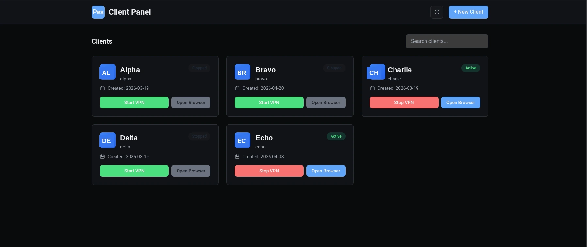
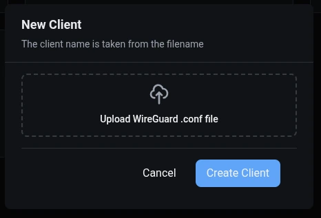

# Pessoa

> Isolated VPN-tunneled browser sessions per client, using Linux network namespaces and WireGuard.

Each client gets its own Linux network namespace with a dedicated WireGuard interface. A Firefox instance launched from the web UI runs entirely inside that namespace, forcing **all** of its traffic through the client's VPN tunnel. Browser profiles (cookies, logins, extensions) persist between sessions.

Named after Fernando Pessoa, who kept dozens of complete literary identities in parallel — each with its own biography, voice, and signature.



## Why

Operators who manage online accounts for multiple clients (social, advertising, hosting, dashboards of all sorts) often need to source traffic from the client's own IP rather than the operator's home connection. Browser containers and cookie-level isolation don't solve this — the network path still leaks. Per-app VPNs and kernel-level namespaces do, but they're CLI tools with no workflow layer on top.

Pessoa is the workflow layer: a local web panel where you manage one namespace-isolated Firefox profile per client, backed by their WireGuard config.

## Architecture

```
┌─────────────────────────────────────────────────────────────────┐
│  Host machine                                                   │
│  ┌─────────────────────────┐                                    │
│  │  Pessoa panel           │   HTTP                             │
│  │  (FastAPI + HTMX)       │◀──────── your browser (port 8000)  │
│  └──────────┬──────────────┘                                    │
│             │ ip netns / wg / firefox                           │
│             ▼                                                   │
│  ┌─────────────────────────┐      ┌───────────────────────────┐ │
│  │  netns: pessoa-{slug}   │      │  ~/.pessoa/clients/{slug} │ │
│  │  ┌───────────────────┐  │      │  ├── wireguard/wg0.conf   │ │
│  │  │ wg-{slug}         │──┼─────▶│  └── browser/profile/     │ │
│  │  │ (WireGuard iface) │  │ VPN  │     (Firefox profile)     │ │
│  │  └───────────────────┘  │      └───────────────────────────┘ │
│  │  ┌───────────────────┐  │                                    │
│  │  │ Firefox           │  │                                    │
│  │  │ (client profile)  │  │                                    │
│  │  └───────────────────┘  │                                    │
│  └─────────────────────────┘                                    │
└─────────────────────────────────────────────────────────────────┘
```

WireGuard interfaces are created on the host (so the UDP socket can reach the VPN server endpoint), then moved into the network namespace. Firefox runs inside the namespace via `ip netns exec`, so every packet it emits must go through the WireGuard tunnel — there is no route out otherwise.

## Requirements

### System
- Linux with systemd (tested on Arch-based distros; should work on any modern distro)
- `wireguard-tools` — for `wg` and `wg-quick`
- `iproute2` — for `ip netns`, `ip link`, `ip addr`, `ip route` (usually preinstalled)
- `procps-ng` — for `pgrep`, `pkill` (usually preinstalled)
- `firefox` — the isolated browser instances
- `sudo` — network namespace operations require root

### Python
- Python 3.11+
- Dependencies pinned in `requirements.txt`

### Passwordless sudo (critical)

Pessoa uses `sudo --non-interactive` for every network-namespace and WireGuard operation. Without a sudoers rule allowing passwordless execution of a short list of commands, **nothing works** — every action in the UI will silently fail.

Create `/etc/sudoers.d/pessoa` (edit with `sudo visudo -f /etc/sudoers.d/pessoa`):

```
# Pessoa - passwordless sudo for network namespace management
# Replace YOURUSER with your login name.
YOURUSER ALL=(root) NOPASSWD: /usr/bin/ip netns *
YOURUSER ALL=(root) NOPASSWD: /usr/bin/ip link *
YOURUSER ALL=(root) NOPASSWD: /usr/bin/ip addr *
YOURUSER ALL=(root) NOPASSWD: /usr/bin/ip route *
YOURUSER ALL=(root) NOPASSWD: /usr/bin/wg *
YOURUSER ALL=(root) NOPASSWD: /usr/bin/tee /etc/netns/*
YOURUSER ALL=(root) NOPASSWD: /usr/bin/mkdir -p /etc/netns/*
YOURUSER ALL=(root) NOPASSWD: /usr/bin/rm -rf /etc/netns/*
YOURUSER ALL=(root) NOPASSWD: /usr/bin/kill *
```

Verify with `sudo -n ip netns list` — should run without a prompt.

## Installation

```bash
git clone https://github.com/YOURUSER/pessoa.git
cd pessoa
python -m venv venv
source venv/bin/activate
pip install -r requirements.txt
```

## Running

### Manual

```bash
python run.py
```

The panel tries port 8000 first. If occupied, it scans up to 8020 and picks the first free one.

### As a systemd user service

```bash
cp systemd/pessoa.service ~/.config/systemd/user/
systemctl --user daemon-reload
systemctl --user enable --now pessoa
journalctl --user -u pessoa -f   # follow logs
```

## Usage

1. Open `http://localhost:8000/`
2. Click **+ New Client** and select a WireGuard `.conf` file. The filename (minus `.conf`) becomes the client slug — keep it to `[a-z0-9-]+` with `pessoa-{slug}` ≤ 15 characters (Linux interface name limit).

   

3. Click **Start VPN** to create the namespace and bring up the tunnel. The card transitions Starting → Active once a handshake completes (usually 1–3 seconds).
4. Click **Open Browser** to launch Firefox inside the namespace with the client's persistent profile.
5. Click **Stop VPN** to tear down the namespace and kill the browser.

Data lives at `~/.pessoa/clients/{slug}/`:
- `wireguard/wg0.conf` — the VPN config you uploaded
- `browser/profile/` — Firefox profile (cookies, logins, extensions persist here)
- `browser/downloads/` — reserved for browser downloads

## Troubleshooting

**The UI loads but nothing happens when I click Start VPN.**
Check passwordless sudo is configured: `sudo -n ip netns list`. If it prompts for a password, fix `/etc/sudoers.d/pessoa`.

**VPN stays in "Starting" forever.**
The namespace was created but no handshake arrived. Likely causes:
- Wrong `Endpoint` in the `.conf` file (host unreachable)
- Firewall blocking outbound UDP to the VPN server
- Server-side: this peer's public key isn't registered or was revoked

Inspect: `sudo ip netns exec pessoa-{slug} wg show` — look at `latest handshake`.

**Client card shows "Error" with a stale handshake.**
Stop and re-start the VPN. If that doesn't help, delete and recreate the client (profile is preserved between stops; deleting the client via the UI removes the profile too).

**Firefox opens but the traffic doesn't seem to go through the VPN.**
Verify from inside the namespace:
```
sudo ip netns exec pessoa-{slug} curl -s https://ifconfig.me
```
The IP returned should match the VPN server's exit IP, not your local public IP.

**Interface name rejected.**
Linux limits interface names to 15 characters. Since the prefix is `wg-`, the slug must be 12 characters or fewer.

## How it works (for contributors)

- `app/main.py` — FastAPI routes, HTTP layer only. No subprocess calls.
- `app/local_client.py` — all system operations (namespaces, WireGuard, browser launch). No HTTP concerns.
- `templates/` — Jinja2 templates. HTMX fragments in `partials/`, full page in `index.html`.
- `static/theme.css` — light/dark theme via CSS custom properties.
- `pessoa-browser` — standalone bash script for launching Firefox inside a namespace, usable outside the panel if needed.

Status is derived from system state, not stored:
- Namespace exists + recent handshake (< 180s) → **Active**
- Namespace exists + handshake timestamp = 0 → **Starting**
- Namespace exists + stale handshake (> 180s) → **Error**
- No namespace → **Stopped** (or **Ready** if config is uploaded but VPN not started)

The frontend polls `/api/clients` every 10 seconds and accelerates to every 2 seconds when any client is in the Starting state.

## License

Copyright (C) 2026 milojarow

This program is free software: you can redistribute it and/or modify it under the terms of the GNU Affero General Public License as published by the Free Software Foundation, version 3.

This program is distributed in the hope that it will be useful, but WITHOUT ANY WARRANTY; without even the implied warranty of MERCHANTABILITY or FITNESS FOR A PARTICULAR PURPOSE. See the [LICENSE](LICENSE) file or <https://www.gnu.org/licenses/agpl-3.0.html> for details.
